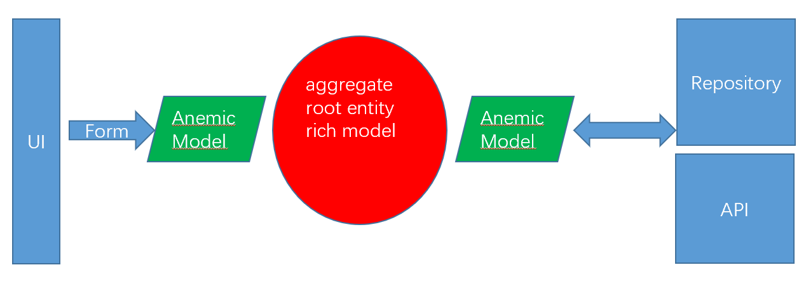
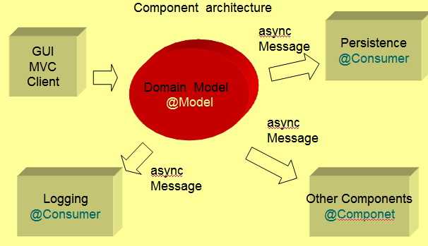

Jivejdon
=========================================

Jivejdon is a full DDD example powered by [jdonframework](https://github.com/banq/jdonframework) 
 it has 
running  for over ten years
at: [https://www.jdon.com/forum](https://www.jdon.com/forum)

Use Case
==============================


DDD Aggregate Model
==============================


[com.jdon.jivejdon.model.ForumMessage](https://github.com/banq/jivejdon/blob/master/src/main/java/com/jdon/jivejdon/model/ForumMessage.java) is the aggregate root, it is a rich model, all setter methods are "private":


but all datas out of domain is packed in a DTO anemic model, so business rules in the aggregate root entity will not leak outside domain. 


these DTO anemic models can alseo be packed in Command and Domain Events，so they be managed in DDD ubiquitous language.


Clean architecture
==============================


Hexagonal_architecture:
``````
OUTSIDE < - > transformer(DTO anemic model) < - >（application < - > domain）
``````

in jivejdon:
``````
View/Jsp(OUTSIDE) ---> models.xml(transfomer/DTO anemic model) ---> ForumMessage
---->Domain Events -----> Repository
``````

the resource file [models.xml](https://github.com/banq/jivejdon/blob/master/src/main/resources/com/jdon/jivejdon/model/models.xml) is a adapter, using AnemicMessageDTO transfom View/Action Form datas:
``````
	<model key="messageId"
			class="com.jdon.jivejdon.model.message.AnemicMessageDTO">
			<actionForm name="messageForm"/>
			<handler>
				<service ref="forumMessageService">
					<initMethod   name="initMessage"/>
					<getMethod    name="findMessage"/>
					<createMethod name="createTopicMessage"/>
					<updateMethod name="updateMessage"/>
					<deleteMethod name="deleteMessage"/>
				</service>
			</handler>
		</model>
``````
when update a message, the message.jsp will call updateMethod's value defined in models.xml;
so it will actually call [forumMessageService](https://github.com/banq/jivejdon/blob/master/src/main/java/com/jdon/jivejdon/service/imp/message/ForumMessageShell.java) updateMessage method:

``````
public interface ForumMessageService {

	void updateMessage(EventModel em) throws Exception;
	
	}
``````

forumMessageService will delegate to aggregate roots: ForumMessage(topic), ForumMessage has two
types: Topic and Rely, one Topic is a root message and has many reply messages, all messages 
compose one Thread(ForumThread)
 
 [ForumMessage](https://github.com/banq/jivejdon/blob/master/src/main/java/com/jdon/jivejdon/model/ForumMessage.java) update message method:
 
 ``````
 	@OnCommand("updateForumMessage")
 	public void update(AnemicMessageDTO newForumMessageInputparamter) {
 		try {
 			merge(newForumMessageInputparamter);
 
 			ForumThread forumThread = this.getForumThread();
 			forumThread.updateMessage(this);
 
 			if (newForumMessageInputparamter.getForum() != null) {
 				Long newforumId = newForumMessageInputparamter.getForum().getForumId();
 				if (newforumId != null && getForum().getForumId() != newforumId) {
 					forumThread.moveForum(this, newForumMessageInputparamter.getForum());
 				}
 			}
			 ....
 			// save this updated message to db
 			eventSourcing.saveMessage(new MessageUpdatedEvent(newForumMessageInputparamter));
             ....
 		} catch (Exception e) {
 			System.err.print(" updateMessage error:" + e + this.messageId);
 		}
 	}

 ``````
 @OnCommand("updateForumMessage") annotation is a command handler in pub-sub model,
 the annotation is from jdon frmaework, make this method executed in a single-writer pattern - no blocked, no lock, high concurrent. only one thread/process invoking this update method.
 
 "eventSourcing.saveMessage" will send a Domain Event to infrastructure layer such as Repository.
 
 
 

Install
===============================
Docker:
1. mvn package
2. docker build -t jivejdondb -f Dockerfile.db .
3. docker run  -p 3306:3306  -e MYSQL_ROOT_PASSWORD=123456 jivejdondb
4. docker build -t jivejdonweb -f Dockerfile.web .
5. docker run  -p 8080:8080 jivejdonweb

browser : http://$DOCKER_HOST_IP:8080


Document
------------------------------------

english: [doc/install_en.txt](./doc/install_en.txt)

chinese: [doc/install_cn.txt](./doc/install_cn.txt)


