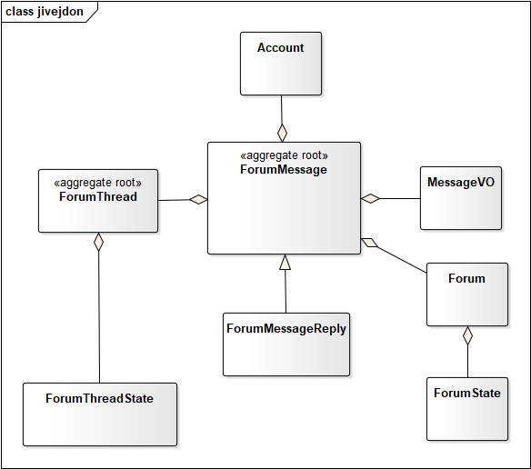
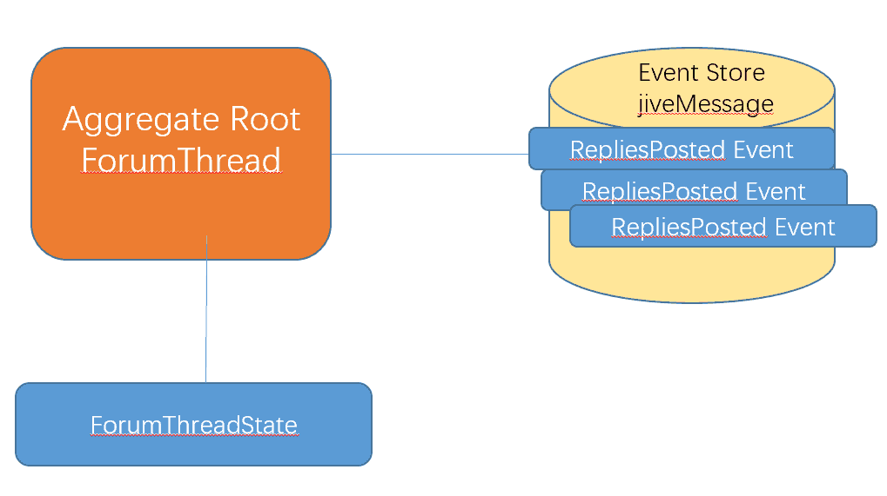
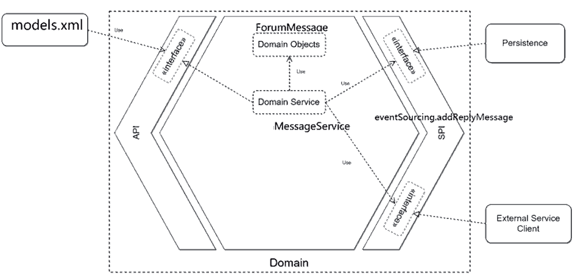

Jivejdon
=========================================

Jivejdon is a full DDD application with Event Soucing/CQRS and clean architecture/Hexagonalarchitecture,  powered by [jdonframework](https://github.com/banq/jdonframework) ,running  for over ten years
in: [https://www.jdon.com/forum](https://www.jdon.com/forum)

Use Case
==============================


DDD Aggregate Model
==============================



[com.jdon.jivejdon.model.ForumMessage](https://github.com/banq/jivejdon/blob/master/src/main/java/com/jdon/jivejdon/model/ForumMessage.java) is the aggregate root entity of post bounded context, it is a rich model not anemic model, no "public" setter method, all setter methods are "private":


Aggregate root entity builder pattern:


Domain Model principles:

1. **High level of encapsulation**

All members setter method are ``private`` by default, then ``internal``. need heavy builder pattern to create aggregate root!

2. **High level of PI (Persistence Ignorance)**

No dependencies to infrastructure, databases, other stuff. All classes are POJO. 

The customer/supply model from jdonframework can seperate domain model from Persistence/Repository.

All datas out of domain is packed in a DTO anemic model([AnemicMessageDTO](https://github.com/banq/jivejdon/blob/master/src/main/java/com/jdon/jivejdon/model/message/AnemicMessageDTO.java)), so business rules in the aggregate root entity will not leak outside domain. 


these DTO anemic models can alseo be packed in Command and Domain Events，so they be managed in DDD ubiquitous business language.

3. **Rich in behavior**

All business logic is located in Domain Model. No leaks to application layer or other places.

4. **Low level of primitive obssesion**

Primitive attributes of Entites grouped together using ValueObjects.
[MessageVO](https://github.com/banq/jivejdon/blob/master/src/main/java/com/jdon/jivejdon/model/message/MessageVO.java) is a valueObject of aggregate root entity[ForumMessage](https://github.com/banq/jivejdon/blob/master/src/main/java/com/jdon/jivejdon/model/ForumMessage.java), inlcude message content: subject and body, it will be processed with complex business filter logic, these filters have many implements,such as: TEXT to HTML.


5. **Business language**

All classes, methods and other members named in business language used in the Bounded Context.


Event Sourcing
==============================
Posting a message is a event, modifying the last replies status for one thread. 



How to get the the last replies status for one thread?we must iterate all posted events collection.

JiveMessage is a posted events collection database table, with a SQL select we can get the last message posted event:

``````

SELECT messageID from jiveMessage WHERE  threadID = ? ORDER BY modifiedDate DESC

``````

There is no special field  for last replyies state in jiveThread, all states are from posted events projection.

When a user post a new ForumMessage, a ReplyMessageCreatedEvent event will be saved to event store: JiveMessage,  simultaneously refresh the snapshot of event: ForumThreadState.


Clean architecture/Hexagonal architecture
==============================
JiveJdon is developed with JdonFramework that supports Customer/Supply or pub-sub model, this model can seperate domain logic from infrastructure, databases, other stuff.


JiveJdon and Hexagonal_architecture:




 [models.xml](https://github.com/banq/jivejdon/blob/master/src/main/resources/com/jdon/jivejdon/model/models.xml) is a adapter, it is XML configure acting as a controller.
``````
	<model key="messageId" class="com.jdon.jivejdon.model.message.AnemicMessageDTO">
		<actionForm name="messageForm"/>
		<handler>
			<service ref="forumMessageService">
			
				<createMethod name="createReplyMessage"/>
					
			</service>
		</handler>
	</model>
``````
When post a replies message,  a POST command will action createReplyMessage method of [forumMessageService](https://github.com/banq/jivejdon/blob/master/src/main/java/com/jdon/jivejdon/service/imp/message/ForumMessageShell.java) :

``````
public interface ForumMessageService {

	Long createReplyMessage(EventModel em) throws Exception;
	....
	
}
``````

Domain sevice forumMessageService will delegate responsibility to business logic object：the aggregate root entity [ForumMessage](https://github.com/banq/jivejdon/blob/master/src/main/java/com/jdon/jivejdon/model/ForumMessage.java), that has two
types: topic post and rely post, topic is a root message and has many replies messages, all messages 
compose one Thread(ForumThread)
 
Business/domain logic is in the addChild message method of [ForumMessage](https://github.com/banq/jivejdon/blob/master/src/main/java/com/jdon/jivejdon/model/ForumMessage.java) 
 
 

 @OnCommand("postReplyMessageCommand") annotation is a command handler in pub-sub model from jdonframework, it can make this method executed in a [single-writer pattern](http://mechanical-sympathy.blogspot.co.uk/2011/09/single-writer-principle.html) - no blocked, no lock, high concurrent. only one thread/process invoking this update method.
 
 "eventSourcing.addReplyMessage" will send a "ReplyMessageCreatedEvent" domain Event to infrastructure layer such as Repository. with the pub-sub model of jdonframework, make domain no dependencies to infrastructure, databases, other stuff.

ReplyMessage Created Event occurring in the domain will be saved in the event storage jiveMessage data table

 Domain event "ReplyMessageCreatedEvent"  occurring in the domain will be saved in event store "jiveMessage" that is a posted events table, used 
 to project the last replies state of a thread. 
 
 
 

Install
===============================
Docker:
1. mvn package
2. docker build -t jivejdondb -f Dockerfile.db .
3. docker run  -p 3306:3306  -e MYSQL_ROOT_PASSWORD=123456 jivejdondb
4. docker build -t jivejdonweb -f Dockerfile.web .
5. docker run  -p 8080:8080 jivejdonweb

browser : http://$DOCKER_HOST_IP:8080


Document
------------------------------------

[english install doc](./doc/install_en.txt)

[chinese install doc](./doc/install_cn.txt)

[chinese design doc](https://www.jdon.com/ddd/jivejdon/1.html)


